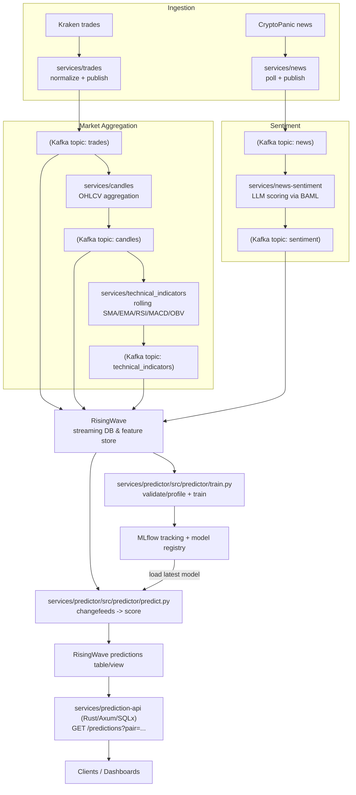

# Real Time Crypto Price Prediction System

An end-to-end, streaming ML platform that forecasts cryptocurrency prices in real time. Trades and headlines are ingested continuously, technical indicators and sentiment are computed on the fly, models are trained and tracked, and fresh predictions are served via a low-latency API.

## Highlights
- Real-time data plumbing: Kafka backbone with RisingWave as the streaming database for windowed aggregates and materialized views.
- Feature engineering on the wire: rolling OHLCV candles plus TA-Lib indicators (SMA/EMA/RSI/MACD/OBV) kept hot in RisingWave tables.
- LLM-powered sentiment: CryptoPanic headlines scored through a BAML client that can talk to Anthropic or OpenAI-compatible endpoints.
- ML lifecycle: training jobs pull the latest features, validate/profile data, train scikit-learn/XGBoost baselines, and log/registry-manage models in MLflow.
- Online inference: a streaming scorer consumes new feature rows and writes predictions back to RisingWave for downstream consumers.
- Serving layer: Rust (Axum + SQLx) API exposes `GET /predictions?pair=<PAIR>` backed by a live `latest_predictions` view.
- Observability & ops: Grafana dashboards, Kafka UI, and dev/prod Kubernetes manifests (Kind for local) plus Docker image builds via Make targets.

## Architecture in brief
1. **Ingest**: Kraken spot trades and CryptoPanic news flow into Kafka topics.
2. **Aggregate**: RisingWave produces rolling candles and exposes them as materialized views.
3. **Engineer**: Technical indicator service maintains sliding windows and emits features to Kafka and RisingWave.
4. **Enrich**: News is LLM-scored for sentiment and joined to market features by pair/timestamp.
5. **Train**: Batch/stream-aligned training pulls from RisingWave, profiles data, tunes models, and registers the best in MLflow.
6. **Predict**: An online predictor streams feature updates, scores with the latest registered model, and persists predictions.
7. **Serve**: Axum API reads the `latest_predictions` view and responds with near-real-time forecasts.

## Why it matters
- Demonstrates a modern streaming + ML stack that keeps feature freshness and model drift under control.
- Shows end-to-end ownership: ingestion, feature engineering, MLOps, inference, API design, and observability.
- Built to be productionizable: containerized services, Kubernetes manifests, env-driven config, and clear separation between batch and online paths.

## Experience gained
- Streaming data engineering (Kafka, RisingWave), windowed aggregations, and online feature stores.
- Applied ML with scikit-learn/XGBoost, model tracking/registry in MLflow, and offline/online feature parity.
- LLM integration for domain-specific sentiment scoring via BAML.
- Backend/API engineering in Rust with Axum and SQLx, plus Python service orchestration.
- DevOps practices: Docker/Kustomize/Kind, environment templating, and dashboarding for SLO visibility.

## Source code
- This repo intentionally ships as a teaser without source code. If you are interested in the source code, please reach out to me.