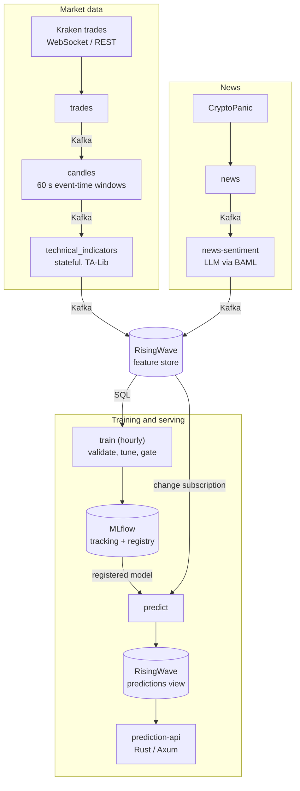

# Real-Time Crypto Price Prediction System

A streaming ML system that forecasts short-term cryptocurrency prices from live exchange data.

- Kraken trades flow through Kafka into one-minute candles and technical-indicator features, which are stored in RisingWave.
- A scheduled pipeline trains, validates and registers models in MLflow.
- An online predictor scores every new feature row, and a Rust API serves the latest forecast.
- A separate service scores crypto news sentiment with an LLM.

> **Status:** in progress (self-directed external training, target Q4 2026). This repository is a public preview. The source code is private and available on request.

## At a glance

| | |
|---|---|
| **Data** | Live Kraken spot trades for 8 pairs (BTC, ETH, SOL and XRP against USD and EUR) over WebSocket, with a REST backfill; CryptoPanic news headlines |
| **Features** | 1-minute OHLCV candles (event-time windows) and 16 technical indicators: SMA, EMA and RSI at 7, 14, 21 and 60 candles, plus MACD and OBV |
| **Target** | BTC/USD close price 5 minutes ahead |
| **Baseline** | Persistence: the price in 5 minutes equals the current price |
| **Model** | Huber regression (robust to price jumps) on standardised features, tuned with Optuna using time-series cross-validation |
| **Evaluation** | Chronological train/test split; test MAE is compared with the baseline before a model is registered |
| **Retraining** | Hourly Kubernetes CronJob on a rolling 60-day window |
| **Serving** | Predictions are precomputed on every feature update and served by a Rust (Axum) API |

## Architecture

```mermaid
flowchart TB
  subgraph MD["Market data"]
    direction LR
    KR["Kraken trades<br/>WebSocket / REST"] --> TR["trades"] -->|Kafka| CA["candles<br/>60 s event-time windows"] -->|Kafka| TI["technical_indicators<br/>stateful, TA-Lib"]
  end

  subgraph NS["News"]
    direction LR
    CP["CryptoPanic"] --> NW["news"] -->|Kafka| SE["news-sentiment<br/>LLM via BAML"]
  end

  TI -->|Kafka| RW[("RisingWave<br/>feature store")]
  SE -->|Kafka| RW

  subgraph ML["Training and serving"]
    direction LR
    TRAIN["train (hourly)<br/>validate, tune, gate"] --> MLF[("MLflow<br/>tracking + registry")] -->|registered model| PRED["predict"] --> RWP[("RisingWave<br/>predictions view")] --> API["prediction-api<br/>Rust / Axum"]
  end

  RW -->|SQL| TRAIN
  RW -->|change subscription| PRED
```

## Components

| Service | Role |
|---|---|
| `trades` | Streams Kraken trades into Kafka, keyed by pair. Runs live (WebSocket) or as a historical backfill (REST). |
| `candles` | Aggregates trades into 60-second OHLCV candles with event-time tumbling windows (Quix Streams). |
| `technical_indicators` | Keeps a per-pair rolling state of recent candles and computes TA-Lib indicators on every update. |
| `news` | Polls CryptoPanic and publishes new headlines, deduplicated with persisted state. |
| `news-sentiment` | Scores each headline per coin (bullish or bearish) with an LLM via BAML. |
| `predictor` (train) | Loads features from RisingWave, builds the target, validates and profiles the data, tunes and evaluates the model, and registers it in MLflow. |
| `predictor` (predict) | Subscribes to changes in the RisingWave feature table, scores new rows with the registered model, and writes the predictions back. |
| `prediction-api` | Rust (Axum + SQLx) service. `GET /predictions?pair=BTC/USD` reads a `latest_predictions` materialised view. |

## ML pipeline

**Training** (hourly):

1. Load the last 60 days of BTC/USD one-minute features from RisingWave.
2. Build the target: the close price five candles ahead.
3. Validate the data (a missing-data threshold, Great Expectations checks) and profile it (ydata-profiling). Log the dataset, the parameters and the report to MLflow.
4. Split the data chronologically, 80/20.
5. Score the persistence baseline.
6. Tune a Huber regression with Optuna, using expanding-window time-series cross-validation on the training set. LazyPredict is available for screening other regressors.
7. Compare test MAE with the baseline. Register the model, with its input signature, only if it passes the promotion gate.

**Inference:** the predictor loads the registered model from MLflow and listens to the feature table through a RisingWave change subscription. It writes each prediction with the model name, the model version and the timestamp the prediction refers to. The API reads the latest prediction per pair, so serving needs no ML code.

## LLM news sentiment

- **Structured output** via BAML: a score per coin (+1 bullish, −1 bearish) and a reason. Coins the headline isn't relevant to are left out.
- **Model choice:** works with Anthropic models or any OpenAI-compatible endpoint, including local open-weight models served by Ollama or llama.cpp.
- **Evaluation:**
  - built a golden dataset by labelling historical CryptoPanic headlines with a large teacher model (Claude Opus 4);
  - curated it with a human in the loop;
  - compared cheaper local models (DeepSeek-R1 7B and 8B) on per-coin agreement, using Opik.
- Sentiment scores are stored in RisingWave. Joining them into the model's features is on the roadmap.

## Infrastructure and MLOps

- Kafka (Strimzi) and RisingWave on Kubernetes, using a Kind cluster for local development. Each service has its own Docker image and Kustomize manifests, built and deployed with Make targets.
- MLflow tracking server and model registry, backed by Postgres and MinIO.
- Grafana dashboards on RisingWave, Kafka UI and Metabase for observability.
- Python 3.12 with uv, pydantic-settings for configuration, and ruff with pre-commit. Rust for the API.

## Roadmap

The next steps are mostly on the research side:

- Predict log-returns instead of price levels. Evaluate with the information coefficient, hit rate and a cost-aware backtest.
- Replace level features with stationary ones, e.g. price relative to its moving averages, recent returns and realised volatility.
- Score only completed candles, so live inputs match the training data.
- Join news sentiment into the features with a point-in-time (as-of) join.
- Capture trade direction to enable order-flow features.
- Tighten promotion: require the model to beat the baseline consistently across walk-forward folds.
- Reload newly registered models without restarting the predictor, and add data-drift reports.

## What this project covers

- **Streaming data engineering:** Kafka, event-time windowing, stateful stream processing, RisingWave materialised views and change subscriptions.
- **Applied ML for time series:** leakage-aware targets, chronological validation, baselines, hyperparameter tuning, experiment tracking and a model registry.
- **LLM engineering:** structured outputs, evaluation against a curated golden dataset, and local open-weight models.
- **Backend and platform:** a Rust API, Docker and Kubernetes.

## Source code

The source code is private. If you'd like to see it, please get in touch.
